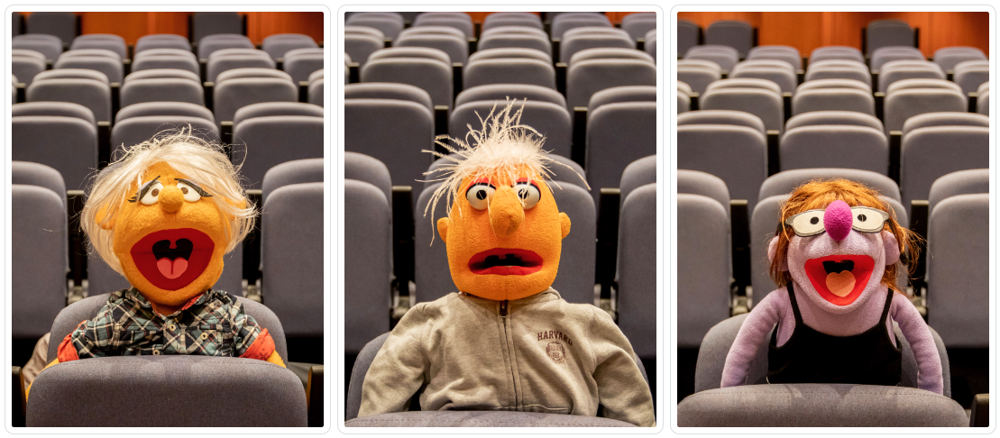
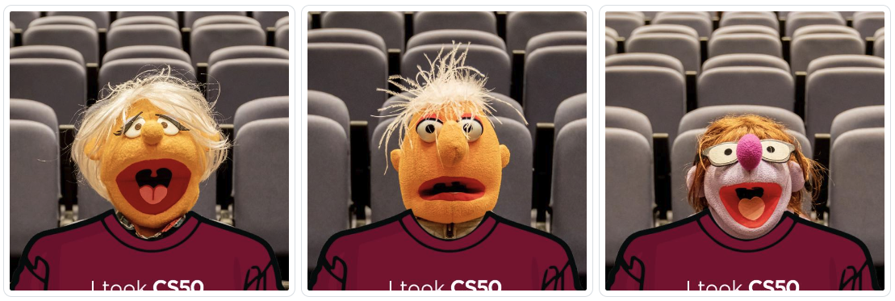

# [CS50 P-Shirt](#cs50-p-shirt)

After finishing CS50 itself, students on campus at Harvard traditionally
receive their very own [I took
CS50](https://cs50.harvardshop.com/collections/print/products/i-took-cs50-unisex-t-shirt)
t-shirt. No need to buy one online, but like to try one on virtually?

In a file called `shirt.py`, implement a program that expects exactly
two command-line arguments:

-   in `sys.argv[1]`, the name (or path) of a
    JPEG or PNG to read (i.e., open) as input
-   in `sys.argv[2]`, the name (or path) of a
    JPEG or PNG to write (i.e., save) as output

The program should then overlay [shirt.png](shirt.png) (which has a
transparent background) on the input after resizing and cropping the
input to be the same size, saving the result as its output.

Open the input with `Image.open`, per
[pillow.readthedocs.io/en/stable/reference/Image.html#PIL.Image.open](https://pillow.readthedocs.io/en/stable/reference/Image.html#PIL.Image.open),
resize and crop the input with `ImageOps.fit`, per
[pillow.readthedocs.io/en/stable/reference/ImageOps.html#PIL.ImageOps.fit](https://pillow.readthedocs.io/en/stable/reference/ImageOps.html#PIL.ImageOps.fit),
using default values for `method`, `bleed`, and `centering`, overlay the
shirt with `Image.paste`, per
[pillow.readthedocs.io/en/stable/reference/Image.html#PIL.Image.Image.paste](https://pillow.readthedocs.io/en/stable/reference/Image.html#PIL.Image.Image.paste),
and save the result with `Image.save`, per
[pillow.readthedocs.io/en/stable/reference/Image.html#PIL.Image.Image.save](https://pillow.readthedocs.io/en/stable/reference/Image.html#PIL.Image.Image.save).

The program should instead exit via `sys.exit`:

-   if the user does not specify exactly two
    command-line arguments,
-   if the input’s and output’s names do not
    end in `.jpg`, `.jpeg`, or `.png`, case-insensitively,
-   if the input’s name does not have the
    same extension as the output’s name, or
-   if the specified input does not exist.

Assume that the input will be a photo of someone posing in just the
right way, like [these demos](#demos), so that, when they’re resized and
cropped, the shirt appears to fit perfectly.

If you’d like to run your program on a photo of yourself, first drag the
photo over to VS Code’s file explorer, into the same folder as
`shirt.py`. No need to submit any photos with your code. But, if you
would like, you’re welcome (but not expected) to share a photo of
yourself wearing your virtual shirt in any of [CS50’s
communities](https://cs50.harvard.edu/python/communities)!

Hints

-   Note that you can determine a file’s
    extension with `os.path.splitext`, per
    [docs.python.org/3/library/os.path.html#os.path.splitext](https://docs.python.org/3/library/os.path.html#os.path.splitext).

-   Note that `open` can `raise` a
    `FileNotFoundError`, per
    [docs.python.org/3/library/exceptions.html#FileNotFoundError](https://docs.python.org/3/library/exceptions.html#FileNotFoundError).

-   Note that the `Pillow` package comes with
    quite a few classes and methods, per
    [pypi.org/project/Pillow](https://pypi.org/project/Pillow/). You
    might find its
    [handbook](https://pillow.readthedocs.io/en/stable/handbook/) and
    [reference](https://pillow.readthedocs.io/en/stable/reference/)
    helpful to skim. You can install the package with:

    ``` highlight
    pip install Pillow
    ```

    You can open an image (e.g., `shirt.png`) with code like:

    ``` highlight
    shirt = Image.open("shirt.png")
    ```

    You can get the width and height, respectively, of that image as a
    `tuple` with code like:

    ``` highlight
    size = shirt.size
    ```

    And you can overlay that image on top of another (e.g., `photo`)
    with code like

    ``` highlight
    photo.paste(shirt, shirt)
    ```

    wherein the first `shirt` represents the image to overlay and the
    second `shirt` represents a “mask” indicating which pixels in
    `photo` to update.

-   Note that you can open an image (e.g.,
    `shirt.png`) in VS Code by running

    ``` highlight
    code shirt.png
    ```

    or by double-clicking its icon in VS Code’s file explorer.


## [Demo](#demo)

``` highlight
$ python shirt.py
Too few command-line arguments
$ python shirt.py foo
Too few command-line arguments
$ python shirt.py foo bar
Invalid input
$ python shirt.py foo bar baz
Too many command-line arguments
$ python shirt.py before.jpg after.png
Input and output have different extensions
$ python shirt.py before.jpg after.jpg
$ python shirt.py before.png after.png
$
```

### [Before](#demos)



### [After](#after)



## [Before You Begin](#before-you-begin)

Log into [cs50.dev](https://cs50.dev/), click on your terminal window,
and execute `cd` by itself. You should find that your terminal window’s
prompt resembles the below:

``` highlight
$
```

Next execute

``` highlight
mkdir shirt
```

to make a folder called `shirt` in your codespace.

Then execute

``` highlight
cd shirt
```

to change directories into that folder. You should now see your terminal
prompt as `shirt/ $`. You can now execute

``` highlight
code shirt.py
```

to make a file called `shirt.py` where you’ll write your program. Be
sure to run

``` highlight
wget https://cs50.harvard.edu/python/2022/psets/6/shirt/shirt.png
```

to download [shirt.png](shirt.png). Also be sure to run

``` highlight
wget https://cs50.harvard.edu/python/2022/psets/6/shirt/muppets.zip
```

to download [muppets.zip](muppets.zip) into your folder. You can run

``` highlight
unzip muppets.zip
```

to extract a collection of muppet photos!


## [How to Test](#how-to-test)

Here’s how to test your code manually:

-   Run your program with `python shirt.py`.
    Your program should exit using `sys.exit` and provide an error
    message:
    ``` highlight
    Too few command-line arguments
    ```
-   Be sure to download
    [muppets.zip](muppets.zip) and extract a collection of muppet photos
    using `unzip muppets.zip`. Run your program with
    `python shirt.py before1.jpg before2.jpg before3.jpg`. Your program
    should output:
    ``` highlight
    Too many command-line arguments
    ```
-   Run your program with
    `python shirt.py before1.jpg invalid_format.bmp`. Your program
    should exit using `sys.exit` and provide an error message:
    ``` highlight
    Invalid output
    ```
-   Run your program with
    `python shirt.py before1.jpg after1.png`. Your program should exit
    using `sys.exit` and provide an error message:
    ``` highlight
    Input and output have different extensions
    ```
-   Run your program with
    `python shirt.py non_existent_image.jpg after1.jpg`. Your program
    should exit using `sys.exit` and provide an error message:
    ``` highlight
    Input does not exist
    ```
-   Run your program with
    `python shirt.py before1.jpg after1.jpg`. Assuming you’ve downloaded
    and unzipped [muppets.zip](muppets.zip), your program should create
    an image like the below:
    

You can execute the below to check your code using `check50`, a program
that CS50 will use to test your code when you submit. But be sure to
test it yourself as well!

``` highlight
check50 cs50/problems/2022/python/shirt
```

Green smilies mean your program has passed a test! Red frownies will
indicate your program output something unexpected. Visit the URL that
`check50` outputs to see the input `check50` handed to your program,
what output it expected, and what output your program actually gave.


## [How to Submit](#how-to-submit)

In your terminal, execute the below to submit your work.

``` highlight
submit50 cs50/problems/2022/python/shirt
```
